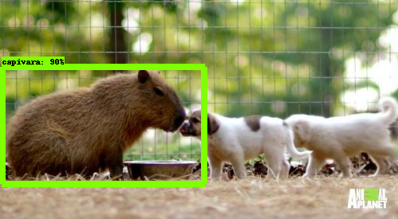
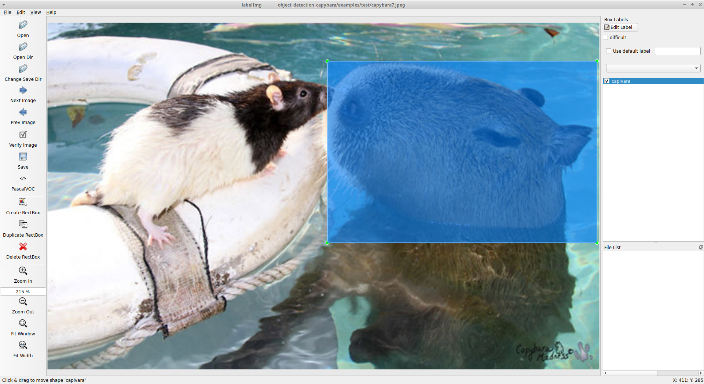

# Capybara Image Segmentation with Auto-Annotation (NOT FINISHED YET)

This repo is a tutorial for training and evaluating the Tensorflow Object Detection API using [Capybara Dataset](https://github.com/freds0/capybara_dataset).

The following steps will be presented regarding the workflow of an object detection project:
- Requirements Installation
- Create the Environment using Docker
- Training on Capybara Dataset
- Exporting your Trained Model do Frozen Graph
- Running Inference
- Auto-Annotating Images

## Requirements Installation

To install the Tensorflow Object detection API, it is necessary to install some basic requirements beforehand.

```buildoutcfg
$ apt-get update && apt-get install -y \
    protobuf-compiler \
    python3-pip \
    python3-pil \
    python3-lxml \
    python3-opencv
```

```buildWhen starting the training process, information will be displayed at each step, like the example below:outcfg
$ pip install tf_slim
```

And, most importantly, you need to install tensorflow:

```buildoutcfg
$ pip install tensorflow-gpu==2.7.0
```

### Tensorflow Object Detection API Installation

A detailed tutorial on installing the runtime environment can be found in the [official documentation](https://tensorflow-object-detection-api-tutorial.readthedocs.io/en/latest/install.html).

```buildoutcfg
$ pip install pycocotools
```

```buildoutcfg
$ cd /
$ git clone --depth 1 https://github.com/tensorflow/models
```

```buildoutcfg
$ cd /models/research/
$ protoc object_detection/protos/*.proto --python_out=.
```

```buildoutcfg
$ cp /models/research/object_detection/packages/tf2/setup.py /models/research
$ cd /models/research/
$ python -m pip install .
```
Testing the installation:

```buildoutcfg
$ cd /content/models/research/
$ python object_detection/builders/model_builder_tf2_test.py
```

```
Ran 24 tests in 20.478s

OK (skipped=1)
```
## Create the Environment using Docker

First, you will need to install the docker. I recommend following [this tutorial](https://cnvrg.io/how-to-setup-docker-and-nvidia-docker-2-0-on-ubuntu-18-04/). After installing Docker, just run the following commands.

To build our image run:

```
$ docker build -t tensorflow_object_detection ./
```

To run container from the image use command:

```
$ docker run --name tf2od -p 8888:8888 -d tensorflow_object_detection
```

## Training on Capybara Dataset

Assuming everything went well during the requirements installation, to do the training on our example dataset [Capybara Dataset](https://github.com/freds0/capybara_dataset), just run the following command:

```
$ python train.py \
    --checkpoint_path=CHECKPOINTS_DIR
    --config_file=PIPELINE_CONFIG_FILE \
    --checkpoint_every_n=CHECKPOINTS_STEPS \
    --num_train_steps=TRAIN_STEPS \
    --num_workers=NUM_WORKS
```
When starting the training process, information will be displayed at each step, like the example below:
```
INFO:tensorflow:Step 100 per-step time 1.938s
I1223 23:31:42.470360 140361518614400 model_lib_v2.py:707] Step 100 per-step time 1.938s
INFO:tensorflow:{'Loss/classification_loss': 0.82733643,
 'Loss/localization_loss': 0.5610607,
 'Loss/regularization_loss': 0.7503873,
 'Loss/total_loss': 2.1387844,
 'learning_rate': 0.1666635}
I1223 23:31:42.473480 140361518614400 model_lib_v2.py:708] {'Loss/classification_loss': 0.82733643,
 'Loss/localization_loss': 0.5610607,
 'Loss/regularization_loss': 0.7503873,
 'Loss/total_loss': 2.1387844,
 'learning_rate': 0.1666635}
 ```

## Exporting your Trained Model do Frozen Graph

Exporting the model to a Frozen Graph file is the best option if you want to continue training, perform inference or use it as a subgraph. To export the trained model, run the following command:

```
$ python export.py \
    --config_file=PIPELINE_CONFIG_FILE \
    --trained_checkpoint_dir=CHECKPOINTS_DIR \
    --output_directory=EXPORTED_CHECKPOINTS_DIR
```

In this way, the model will be exported to the output folder, generating the following folder structure:
```
├─ EXPORTED_CHECKPOINTS_DIR/
│  └─ checkpoint/
│  └─ saved_model
│  └─ pipeline.config
└─ ...
```
Now your model is ready to perform the inference process.

## Running Inference

From a trained and exported model, you can perform inference and detect Capybaras in your own images using the following command:

```
$ python inference.py \
    --model_path=EXPORTED_CHECKPOINTS_DIR \
    --image_path=SOURCE_IMAGES_DIR \
    --label_map=LABEL_MAP_FILE \
    --output_path=OUTPUT_IMAGES_DIR
```
Below is an example image of the result:



## Auto-Annotating Images

You can use a pre-trained model, with an early version of the dataset, to produce more annotated images for model training. Of course, just these annotated images will not contribute to learning the model. This tool aims to facilitate the data annotation step, as it will produce the bounding-boxes, classifying them. Therefore, automatically annotated images must still be validated or corrected manually.

To generate annotations in xml format, run the following command:

```
$ python annotate.py \
    --model_path=EXPORTED_CHECKPOINTS_DIR \
    --image_path=SOURCE_IMAGES_DIR \
    --label_map=LABEL_MAP_FILE \
    --output_path=OUTPUT_XML_DIR
```

Thus, for each image present in the SOURCE_IMAGES_DIR directory, a corresponding XML file will be created in the OUTPUT_XML_DIR directory.

```
├─ SOURCE_IMAGES_DIR/
│  └─ image_1.jpg
│  └─ image_2.jpg
│  └─ ...
│  └─ image_n.jpg
│  
├─ OUTPUT_XML_DIR/
│  └─ image_1.xml
│  └─ image_2.xml
│  └─ ...
│  └─ image_n.xml
```

To view the annotations, copy the images to the same directory as the xml files and use the LabelImg program.

```buildoutcfg
$ labelImg
```



If you need to export annotations to another format (eg COCO or YOLO), check the "tools" folder which contains some conversion scripts.

## References

- [TensorFlow 2 Object Detection API tutorial](https://tensorflow-object-detection-api-tutorial.readthedocs.io/en/latest/index.html)
- [image-segmentation-with-Mask-RCNN](https://github.com/sniper0110/image-segmentation-with-Mask-RCNN)
- [Train a Mask R-CNN model with the Tensorflow Object Detection API](https://github.com/TannerGilbert/Tensorflow-Object-Detection-API-train-custom-Mask-R-CNN-model)
- [Automated Image Annotation using Auto-Annotate Tool](https://medium.com/analytics-vidhya/automated-image-annotation-using-auto-annotate-tool-f8fff8ea4900)
- [Splash of Color: Instance Segmentation with Mask R-CNN and TensorFlow](https://engineering.matterport.com/splash-of-color-instance-segmentation-with-mask-r-cnn-and-tensorflow-7c761e238b46)

## Copyright

See [LICENSE](https://github.com/freds0/object_detection_capybara/blob/main/LICENSE) for details. Copyright (c) 2021 Fred Oliveira.
